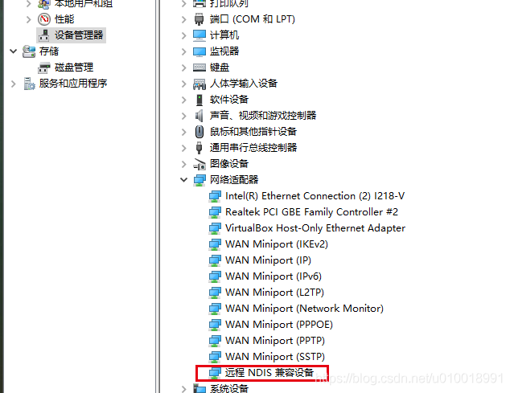
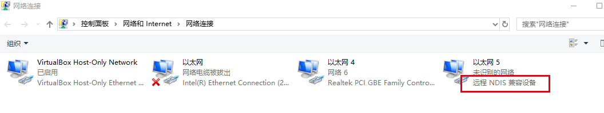
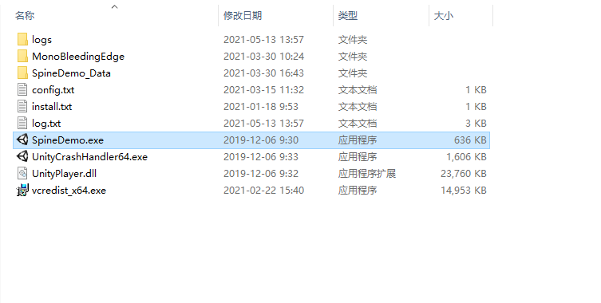

# 1. 概览

### 1.1 概况：

软件全称：青少年脊柱侧弯数字测评与主动健康（以下简称测量软件）

版本号：1.0.3

### 1.2 安装

* 断网
* 配置虚拟网卡

打开“设备管理器”，右键 “USB-DEV”

→“更新驱动程序”

→“浏览我得计算机以查找驱动程序软件\(R\)”

→“让我从计算机上的可用驱动程序列表中选取\(L\)”

→“网络适配器”

→“Microsoft”

→“远程NDIS兼容设备”

→忽略警告，点击“是”

此时出现 “设备管理器”→“网络适配器”→“远程NDIS兼容设备”

* 修改电脑ip地址

配置虚拟网卡ip：192.168.1.111

网关：192.168.1.1

* 启动软件

