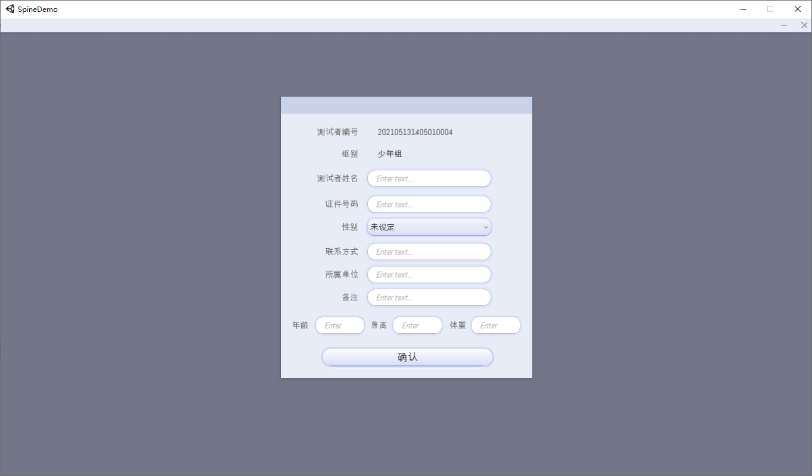
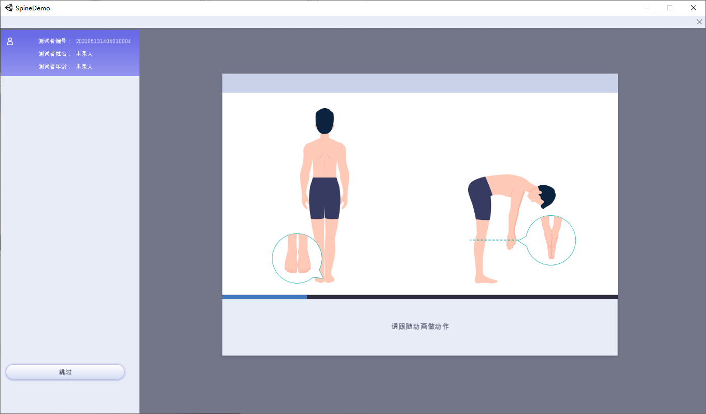
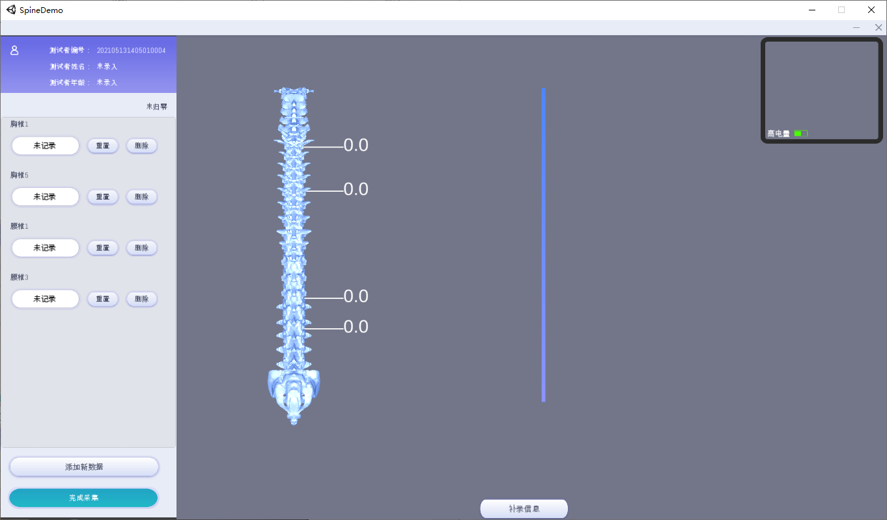
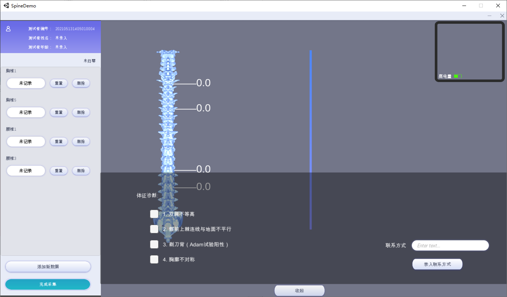
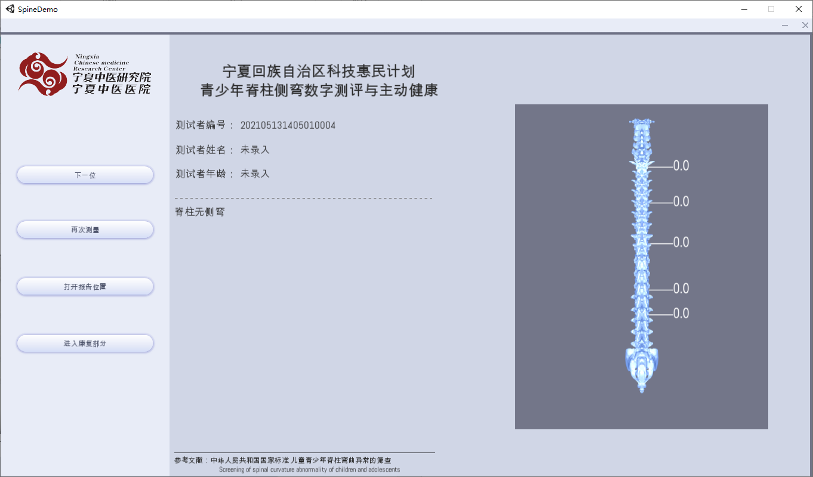
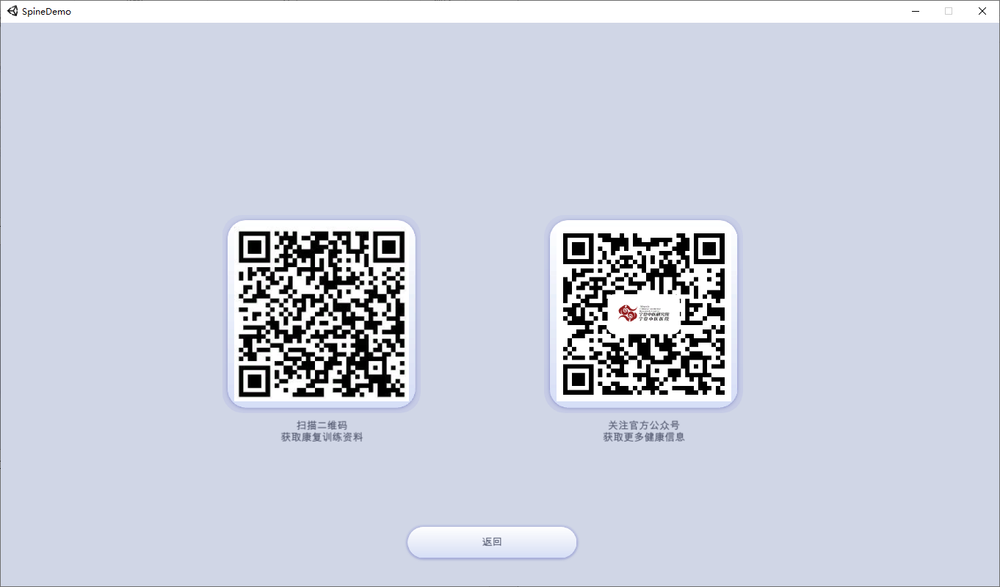

# 2. 界面

### 2.1 首页

点击测量按钮开始

### 2.2 登记信息界面

填入被测试的人的信息，填好后点击确认。所有数据都可以不填跳过，报告会自动生成测试者编号，并根据时间依次递增。

组别的默认内容可以通过config文件配置。

### 2.3 学习动作界面

看动画，学习测试动作，可以跳过。

### 2.4 测量界面

使用测量尺测量的默认四个节点分别是：胸椎第1节（总第8节）、胸椎第5节（总第12节）、胸椎第1节（总第20节）、腰椎第3节（总第22节）。

默认测量节点可以通过config配置。

软件左侧的状态位置，显示的是当前测量尺的状态，分为“未归零”，“已归零”，“已记录X”。提示操作者必须先归零，再记录，同时提示当前记录到哪几个位置了。

### 2.5 修改测量方案界面

如果想添加新测试节点，点击下面的添加新数据按钮。添加完成后点击完成。

### 2.6 补充诊断数据界面

对于肉眼观测现象、医生主观判断、患者信息收集的信息补录。结果会体现在报告上。

### 2.7 确认报告界面

全部数据测量完成后，点击完成采集按钮生成报告。

可以在本界面对报告信息进行确认。如果不满意当前结果，或有遗漏，点击再次测量按钮，可以进行重测。

重测的基本数据会和上一个数据保持一致，但是编号递增一位。两个重测数据都会生成pdf报告。

### 2.8 康复界面

