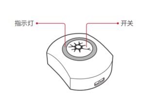
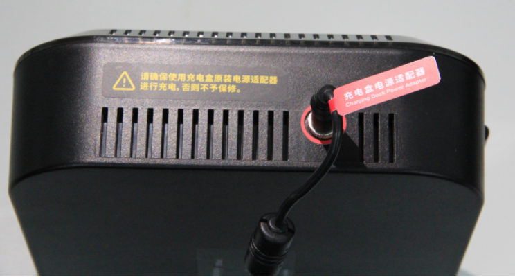

# 2. 设备详情

### 2.1 电子测量尺

内部集成了锂电池、蓝牙发射器、指示灯。

* 充电

使用USB充电线，接入测量尺侧面的充电口。本产品使用160mAh锂电池，充电电压3.7V。

* 指示灯说明

| 指示灯状态 | 描述 |
| :--- | :--- |
| 蓝色亮起 | 按钮按下时，指示灯会亮起一次，如果确定按动了按钮，但指示灯没亮，则是硬件故障 |
| 蓝色常亮 | 充电完成 |
| 红色连续闪烁 | 电量不足 |

* 开启方式

将蓝牙接收器插入电脑USB接口后，使用PPT或者Word文档的上下翻页功能，确定归零键和打点键可用。

### 2.2 PNS传感器

 无线九轴 MEMS 惯性传感器，内部集成了陀螺仪，加速度计和磁力计。

* 充电

使用充电盒充电器进行充电

* 指示灯说明

| 指示灯状态 | 描述 |
| :--- | :--- |
| 慢闪 | 传感器处在待机状态，以节省电量 |
| 快闪 | 传感器处于工作模式，计算传输数据 |
| 高频快闪 | 硬件故障 |
| 常亮 | 传感器周围存在磁干扰 |
| 红色 | 传感器低电量/或处于充电状态 |
| 绿色 | 1 信道 |
| 蓝色 | 2 信道 |
| 紫色 | 3 信道 |
| 蓝绿色 | 4 信道 |
| 白色 | 5 信道 |
| 黄色 | 6 信道 |

* 开启方式

自动开启：

拔下充电盒充电线的时候，盒子里的PNS传感器会自动开启，此时指示灯进入慢闪模式，如果在5分钟内没有连接软件，传感器会自动关机。

手动开启：

按动传感器顶部按钮约 2 秒开启传感器，按住开关约 5 秒关闭传感器。指示灯状态代表传感器的状态（ 参见指示灯说明 ）

### 2.3 PNS接收器

必须和同信道的PNS接收器配对使用。

* 指示灯说明

| 指示灯状态 | 描述 |
| :--- | :--- |
| 常亮（红色） | 等待接通 |
| 绿色 | 1 信道 |
| 蓝色 | 2 信道 |
| 紫色 | 3 信道 |
| 蓝绿色 | 4 信道 |
| 白色 | 5 信道 |
| 黄色 | 6 信道 |

* 开启方式

将接收器接入电脑，接收器指示灯为红色。当接收器指示灯变成信道对应颜色并和传感器信道颜色一致时，开启成功。

* 供电说明

USB供电电压：USB: 5V ⎓162mA 或 PoE

### 2.4 蓝牙USB接收器

需要连接电脑的USB接口使用

