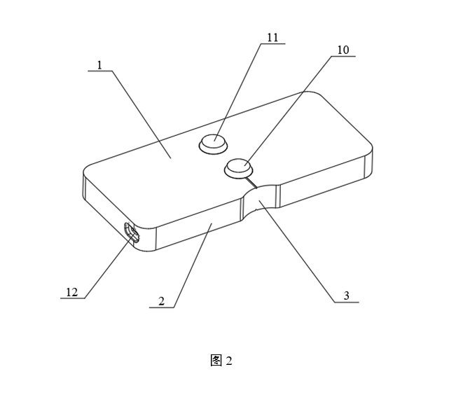
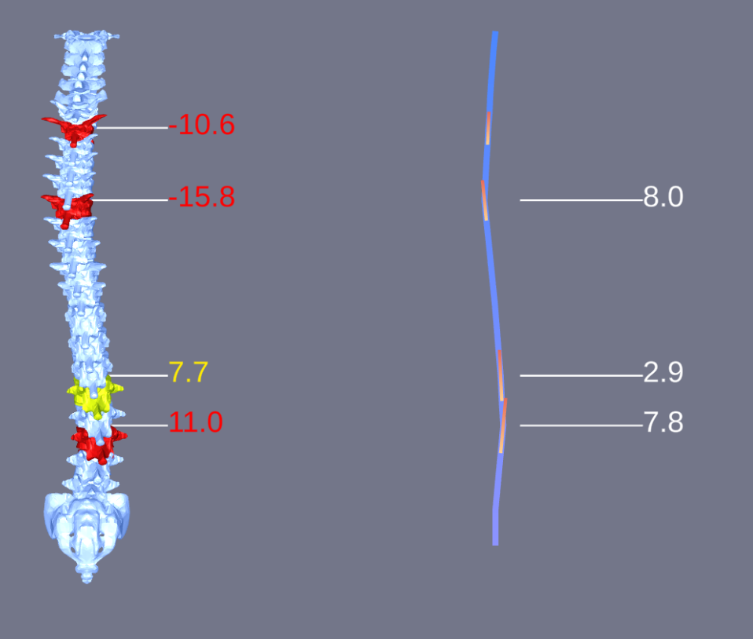

# 3. 测量

### 3.1 归零键

如图所示，接近弧度位置的键是**归零键**。用于将记录一个基准角度用作测量的零点角度。

测量开始前，先找一个平面（如平行于地面的桌面），将测量尺放好，点击归零键让数据归零重置。再找不同的骨骼节点进行打点操作。

**注意：归零时的朝向和测量时的朝向必须保持一致。不能转过大的角度（大于45度）。**

_如：测量尺归零时追踪器朝向东边，尾部朝向西边，那么测量时，也得保持追踪器朝东尾部朝西这个角度。_

### 3.2 打点键

如图所示，远离弧度位置的键是**打点键**。用于记录当前传感器的角度。

打点时，将测量尺放置在对应的骨骼节点上放稳，手不要抖动。单击打点键按钮，不能反复按，按一次记录一次数据，当四个节点数据都记录完成后，再次点击会覆盖第一次的记录。

### 3.3 数据

获得测试数据的节点，脊椎模型上对应的节点会变色高亮。

其中：

数据**0~±5°**为**绿色**，是正常偏移范围

数据**±5°＜α＜10°**，是**黄色**，弯曲偏大，需要进一步检查，或进行步态和其他动态测试

数据**＞10°**，是**红色**，弯曲明显不正常，需要进行明确治疗

### 3.4 传感器模块

白色的模块是传感器模块的3D化表现，可以从这里看传感器工作状态，是否还在连接中

### 3.5 Cobb角

测量了脊柱节点后，会在右侧推算出两个测量节点之间的cobb角

