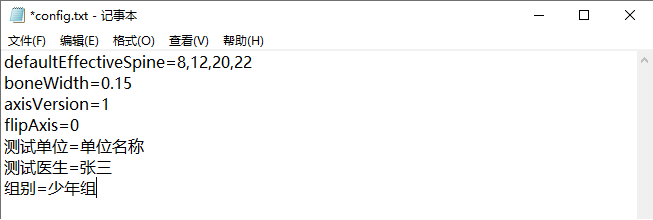

# 5. 参数配置 config setting

DefaultEffectiveSpne：默认的测量节点。添加新节点后会在默认情况中体现。

boneWidth：棘突长度，参数越大，脊柱3D模型的扭曲越明显，但同时测量敏感度也越高，不建议大幅修改。

axisVersion：不要改

flipAxis：测量尺的正握和反握（左右手操作便利）。0是正握，按钮对着自己，1是反握，按钮背向自己。这个参数填反了会导致测量结果左右方向相反。

测试单位：报告上数据的默认值，修改后报告会一起变更。

测试医生：报告上数据的默认值，修改后报告会一起变更。

组别：报告上数据的默认值，修改后报告会一起变更。

