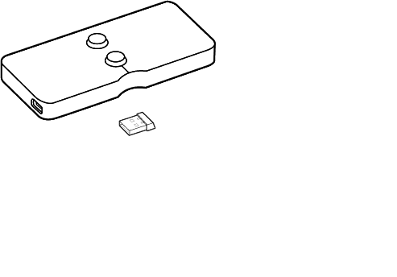

# 1. 概览

### 1.1 主要硬件列表

<table>
  <thead>
    <tr>
      <th style="text-align:left">&#x8BBE;&#x5907;</th>
      <th style="text-align:left">&#x6570;&#x91CF;</th>
      <th style="text-align:left">&#x8BF4;&#x660E;</th>
    </tr>
  </thead>
  <tbody>
    <tr>
      <td style="text-align:left">&#x7535;&#x5B50;&#x6D4B;&#x91CF;&#x5C3A;</td>
      <td style="text-align:left">1</td>
      <td style="text-align:left">&#x4E3B;&#x4F53;</td>
    </tr>
    <tr>
      <td style="text-align:left">PNS&#x4F20;&#x611F;&#x5668;</td>
      <td style="text-align:left">2</td>
      <td style="text-align:left">&#x4E00;&#x53F0;&#x6D4B;&#x91CF;&#x5C3A;&#x4F7F;&#x7528;&#x4E00;&#x4E2A;&#xFF0C;&#x53E6;&#x4E00;&#x4E2A;&#x505A;&#x5907;&#x7528;</td>
    </tr>
    <tr>
      <td style="text-align:left">PNS&#x63A5;&#x6536;&#x5668;</td>
      <td style="text-align:left">1</td>
      <td style="text-align:left"></td>
    </tr>
    <tr>
      <td style="text-align:left">&#x84DD;&#x7259;USB&#x63A5;&#x6536;&#x5668;</td>
      <td style="text-align:left">1</td>
      <td style="text-align:left">&#x5FC5;&#x987B;&#x5BF9;&#x5E94;&#x4E00;&#x53F0;&#x6D4B;&#x91CF;&#x5C3A;&#x5BF9;&#x5E94;&#x4E00;&#x4E2A;&#x84DD;&#x7259;&#x63A5;&#x6536;&#x5668;&#xFF0C;&#x591A;&#x53F0;&#x4E0D;&#x53EF;&#x6DF7;&#x7528;</td>
    </tr>
    <tr>
      <td style="text-align:left">USB&#x7EBF;</td>
      <td style="text-align:left">2</td>
      <td style="text-align:left">
        <ol>
          <li>PNS&#x63A5;&#x6536;&#x5668;&#x63A5;&#x7535;&#x8111;&#x4F7F;&#x7528;</li>
          <li>&#x7535;&#x5B50;&#x6D4B;&#x91CF;&#x5C3A;&#x9502;&#x7535;&#x6C60;&#x5145;&#x7535;&#x7528;</li>
          <li>&#x4E8C;&#x8005;&#x4E0D;&#x53EF;&#x6DF7;&#x7528;</li>
        </ol>
      </td>
    </tr>
  </tbody>
</table>

### 1.2 电脑配置

| 推荐配置 |
| :--- |
| CPU：Intel\(R\) Core i5-650 CPU @ 3.20GHz 及以上 |
| 显卡：GeForce 700及以上 |
| 网卡（必要） |

### 1.3 系统拓扑图

* 传感器和蓝牙必须都和电脑连接成功时，产品才能正常使用。
* 电脑设置为虚拟网卡，不能联网

